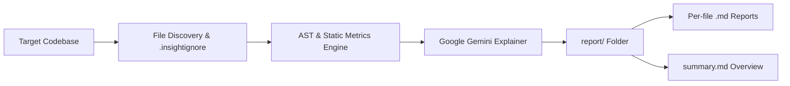

# Insight — Code Analysis & Exploration CLI

<div align="center">

[](https://github.com/ferrix-lab/Insight-Py/actions/workflows/ci.yml)
[](https://pypi.org/project/insight-cli-sarang/)
[](https://pypi.org/project/insight-cli-sarang/)
[](https://opensource.org/licenses/MIT)
[](https://github.com/astral-sh/ruff)

[](https://pepy.tech/projects/insight-cli-sarang)
[](https://pepy.tech/projects/insight-cli-sarang)

<p align="center">
  <strong>Understand any codebase in minutes.</strong><br>
  Insight pairs AST-grounded static code metrics with Google's Gemini AI to generate structured, human-readable architecture reports and file walkthroughs.
</p>

[Quick Start](#quick-start) •
[Documentation](#documentation) •
[Features](#key-features) •
[Supported File Types](#supported-file-types) •
[Contributing](#contributing)

</div>

---

## How It Works



1. **Discovery:** Scans your project directory while strictly respecting `.insightignore` and standard exclusions (`node_modules`, `venv`, `.git`).
2. **Static Analysis:** Extracts line counts, functions, classes, imports, and comment density.
3. **AI Explainer:** Leverages Google's Gemini API to summarize file responsibilities, core workflows, and architectural roles.
4. **Structured Reports:** Produces a clean Markdown report suite inside a dedicated `report/` folder.

---

## Key Features

- **Broad Language Support:** Detects and processes 35+ file types across systems, backends, frontends, and config files.
- **Static Metrics Collection:** Accurately tallies total lines, comments, functions, classes, and imported dependencies.
- **AI-Powered File Walkthroughs:** Explains intricate functions, algorithms, and business logic in plain, accessible language.
- **Actionable Markdown Output:** Generates clean, navigable `.md` reports ready to commit into documentation centers or wikis.
- **Lightweight CLI:** Zero heavy background daemons or database setup required.

---

## Quick Start

### 1. Install via pip

Install the published package directly from PyPI:

```bash
pip install insight-cli-sarang
```

### 2. Set Your API Key

Get a free API key from [Google AI Studio](https://aistudio.google.com/app/api-keys) and set it in your environment:

```bash
# macOS / Linux (Bash or Zsh):
export GOOGLE_API_KEY="your_api_key_here"

# Windows (PowerShell):
$env:GOOGLE_API_KEY="your_api_key_here"

# Windows (Command Prompt):
set GOOGLE_API_KEY=your_api_key_here
```
*(Note: `GEMINI_API_KEY` is also supported as an alias).*

### 3. Run Analysis

Analyze your current project directory:

```bash
insight .
# or
insight-cli .
```

View the generated reports:

```bash
ls report/
cat report/summary.md
```

---

## CLI Reference & Examples

```
usage: insight [-h] [--version] [-o OUTPUT] [--limit LIMIT] path
```

| Argument | Description | Default |
|---|---|---|
| `path` | Path to the directory or source file to analyze | *Required* |
| `-o`, `--output` | Destination directory for generated markdown reports | `report` |
| `--limit` | Limit total number of files analyzed (ideal for testing) | `None` (all files) |
| `-v`, `--version` | Show the installed CLI version | |
| `-h`, `--help` | Display help message and options | |

### Common Examples

```bash
# Analyze a specific repository folder
insight /path/to/my-codebase

# Save reports to a custom folder
insight . -o ./docs/codebase_audit

# Test run on only the first 5 source files
insight . --limit 5
```

---

## Supported File Types

Insight parses and categorizes files across major development domains:

| Domain | Supported Extensions |
|---|---|
| **Programming** | `.py`, `.js`, `.ts`, `.tsx`, `.jsx`, `.java`, `.cpp`, `.c`, `.cs`, `.go`, `.rb`, `.php`, `.rs`, `.swift`, `.kt`, `.scala`, `.dart`, `.lua`, `.pl`, `.sh`, `.bat`, `.r`, `.m`, `.mm` |
| **Web & UI** | `.html`, `.htm`, `.css`, `.scss`, `.less`, `.vue`, `.svelte`, `.ejs`, `.erb`, `.mustache` |
| **Config & Data** | `.json`, `.yaml`, `.yml`, `.toml`, `.ini`, `.cfg`, `.xml`, `.proto`, `.graphql`, `.tf`, `.sql` |
| **Notebooks & Docs**| `.ipynb`, `.md`, `.rst` |
| **Build & DevOps** | `.gradle`, `.pom`, `.makefile`, `.cmake`, `.dockerfile` |

---

## Output Report Structure

When Insight completes, your output folder is organized as follows:

```txt
report/
├── summary.md              # Global repository summary and file index
├── cli.py.md               # Explanation & metrics for cli.py
├── analyzer.py.md          # Explanation & metrics for analyzer.py
└── ...
```

### Sample `summary.md`:
```markdown
# Insight Codebase Summary

**Total files analyzed:** 14
**Total lines of code:** 2,480

## Files Included
- [cli.py](cli.py.md) (120 lines)
- [analyzer.py](analyzer.py.md) (245 lines)
```

---

## Roadmap & Upcoming Features

- [ ] **Offline / Static-Only Mode:** Run without an API key using `--static` ([#30](https://github.com/ferrix-lab/Insight-Py/issues/30))
- [ ] **Tree-Sitter Multi-Language AST:** Real function, class, and export extraction for JS/TS, Go, Rust, and Java ([#32](https://github.com/ferrix-lab/Insight-Py/issues/32))
- [ ] **Concurrent Processing:** Async multi-threaded file analysis with rate limit backoff ([#33](https://github.com/ferrix-lab/Insight-Py/issues/33))
- [ ] **Local LLM Support:** Offline AI summaries via Ollama and LM Studio ([#31](https://github.com/ferrix-lab/Insight-Py/issues/31))
- [ ] **Interactive HTML Dashboard:** Standalone responsive single-page report ([#34](https://github.com/ferrix-lab/Insight-Py/issues/34))

---

## Documentation

For in-depth guides, visit:
- **[INSTRUCTION.md](INSTRUCTION.md):** Complete setup, API keys, environment persistence, and troubleshooting FAQs.
- **[CONTRIBUTING.md](CONTRIBUTING.md):** Contributor guidelines, development environment setup, coding standards, and PR workflows.
- **[CODE_OF_CONDUCT.md](CODE_OF_CONDUCT.md):** Community participation standards.

---

## Contributing

Contributions are warmly welcomed! Please check out [open issues](https://github.com/ferrix-lab/Insight-Py/issues) or look for [`good first issue`](https://github.com/ferrix-lab/Insight-Py/labels/good%20first%20issue) tags to get started.

```bash
git clone https://github.com/ferrix-lab/Insight-Py.git
cd Insight-Py
pip install -e ".[dev]"
pytest
```

---

## License

This project is licensed under the **MIT License** — see the [LICENSE](LICENSE) file for details.

## Troubleshooting

- Prefer a virtualenv when developing; run `pip install -e ".[dev]"` for tests.
